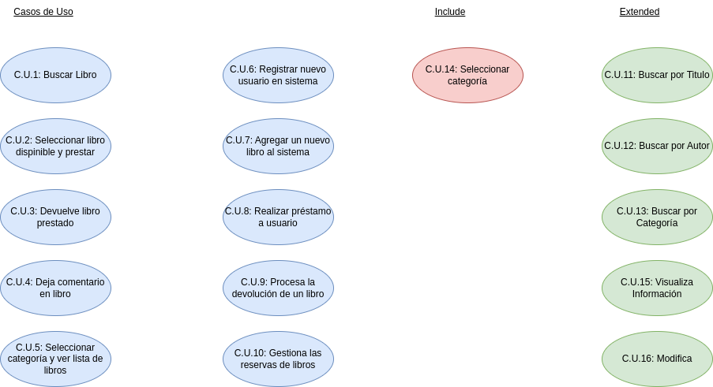
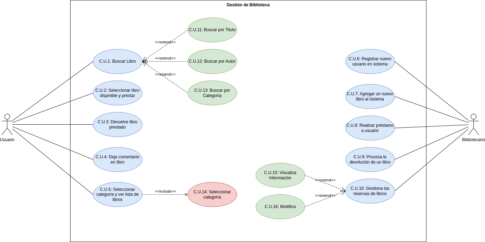

 

# Diagrama Casos de Uso

 

## Indice

- [Actores ](#actores)

- [Casos de Uso ](#casoUso)

- [Diagrama ](#diagrama)

- [Especificaciones ](#especificaciones)

  - [Actores ](#ActoresEspe)

    - [Usuario](#UsuarioEspe)
    - [Bibliotecario](#BibliotecarioEspe)

  - [Casos de Uso ](#CasoUsoEspe)

    - [Caso de Uso 1](#CU1)
    - [Caso de Uso 2](#CU2)
    - [Caso de Uso 3](#CU3)
    - [Caso de Uso 4](#CU4)
    - [Caso de Uso 5](#CU5)
    - [Caso de Uso 6](#CU6)
    - [Caso de Uso 7](#CU7)
    - [Caso de Uso 8](#CU8)
    - [Caso de Uso 9](#CU9)
    - [Caso de Uso 10](#CU10)

## Actores 

 

 

 

## Casos de Uso 

 

 

 

## Diagrama 

 

 

 

 

# Especificaciones 

## Actores 

|  Actor | Usuario |
|---|---|
| Descripción  | _Persona que pretende sacar un libro de la biblioteca_  |
| Características  | - - - |
| Relaciones | - - -  |
| Referencias | _C.U.1, C.U.2, C.U.3, C.U.4, C.U.5_ |   
|  Notas |  - - - |
| Autor  | _Pedro Martín Escuela_ |
|Fecha | _23/01/2024_ |

|  Atributos Usuario |||
|---|---|---|
| Nombre  | _Nombre del usuario_  | _String_ |
| Número de Identificador  | _Numero que identifica a cada usuario_  | _Int_ |
| Historial de Préstamos  | _Historial que muestra los libros que ha tomado prestados de la biblioteca_  | _String_ |

 

|  Actor | Bibliotecario |
|---|---|
| Descripción  | _Persona que trabaja en la biblioteca gestionando los libros, los pretamos y las devoluciones_  |
| Características  | - - - |
| Relaciones | - - -  |
| Referencias | _C.U.6, C.U.7, C.U.8, C.U.9, C.U.10_ |   
|  Notas |  - - - |
| Autor  | _Pedro Martín Escuela_ |
|Fecha | _23/01/2024_ |

|  Atributos Bibliotecario |||
|---|---|---|
| Nombre  | _Nombre del empleado_  | _String_ |
| Número de Empleado  | _Numero que identifica a cada empleado_  | _Int_ |
| Horario Laboral  | _Horario de trabajo del propio empleado_  | _String_ |

 

## Casos de Uso 

|  Caso de Uso 1 | Buscar libro |
  |---|---|
  | Fuentes  | [Proyecto Biblioteca](https://github.com/jpexposito/docencia/tree/master/Primero/ETS/PROYECTO)  |
  | Actor  |  _Usuario_ |
  | Descripción | _Busca un libro en el sistema_ |
  | Flujo básico | - - - |
  | Pre-condiciones | - - - |  
  | Post-condiciones  | Buscar por Título, Buscar por Autor, Buscar por Categoría |  
  |  Requerimientos | - - - |
  |  Notas |  - - - |
  | Autor  | _Pedro Martín Escuela_ |
  |Fecha | _24/01/2024_ |

   

  

  |  Caso de Uso 2 | Seleccionar y Prestar |
  |---|---|
  | Fuentes  | [Proyecto Biblioteca](https://github.com/jpexposito/docencia/tree/master/Primero/ETS/PROYECTO) |
  | Actor  | _Usuario_ |
  | Descripción | _Selecciona un libro y lo presta_  |
  | Flujo básico | - - - |
  | Pre-condiciones | - - - |  
  | Post-condiciones  | - - - |  
  |  Requerimientos | - - - |
  |  Notas | - - - |
  | Autor  | _Pedro Martín Escuela_ |
  |Fecha | _24/01/2024_ |

   

  

  |  Caso de Uso 3 | Devuelve Libro Prestado |
  |---|---|
  | Fuentes  | [Proyecto Biblioteca](https://github.com/jpexposito/docencia/tree/master/Primero/ETS/PROYECTO) |
  | Actor  | _Usuario_ |
  | Descripción | _Devuelve un libro que haya tomado prestado con anterioridad_ |
  | Flujo básico | - - - |
  | Pre-condiciones | - - - |  
  | Post-condiciones  | - - - |  
  |  Requerimientos | - - - |
  |  Notas | - - - |
  | Autor  | _Pedro Martín Escuela_ |
  |Fecha | _24/01/2024_ |

   

  

  |  Caso de Uso 4 | Deja Comentario |
  |---|---|
  | Fuentes  | [Proyecto Biblioteca](https://github.com/jpexposito/docencia/tree/master/Primero/ETS/PROYECTO) |
  | Actor  | _Usuario_ |
  | Descripción | _Comenta en un libro_  |
  | Flujo básico | - - - |
  | Pre-condiciones | - - - |  
  | Post-condiciones  | - - - |  
  |  Requerimientos | - - - |
  |  Notas | - - - |
  | Autor  | _Pedro Martín Escuela_ |
  |Fecha | _24/01/2024_ |

   

  

  |  Caso de Uso 5 | Ver Lista de Libros |
  |---|---|
  | Fuentes  | [Proyecto Biblioteca](https://github.com/jpexposito/docencia/tree/master/Primero/ETS/PROYECTO) |
  | Actor  | _Usuario_ |
  | Descripción | _Ve la lista de libros existentes en una categoría_  |
  | Flujo básico | - - - |
  | Pre-condiciones | - - - |  
  | Post-condiciones  | - - - |  
  |  Requerimientos | Seleccionar Categoría |
  |  Notas | - - - |
  | Autor  | _Pedro Martín Escuela_ |
  |Fecha | _24/01/2024_ |

   

  

  |  Caso de Uso 6 | Registrar Usuario |
  |---|---|
  | Fuentes  | [Proyecto Biblioteca](https://github.com/jpexposito/docencia/tree/master/Primero/ETS/PROYECTO) |
  | Actor  | _Bibliotecario_ |
  | Descripción | _Registra un nuevo usuario en el sistema de la biblioteca_ |
  | Flujo básico | - - - |
  | Pre-condiciones | - - - |  
  | Post-condiciones  | - - - |  
  |  Requerimientos | - - - |
  |  Notas | - - - |
  | Autor  | _Pedro Martín Escuela_ |
  |Fecha | _24/01/2024_ |

   

  

  |  Caso de Uso 7 | Agregar Libro |
  |---|---|
  | Fuentes  | [Proyecto Biblioteca](https://github.com/jpexposito/docencia/tree/master/Primero/ETS/PROYECTO) |
  | Actor  | _Bibliotecario_ |
  | Descripción | _Agrega nuevo libro al sistema_  |
  | Flujo básico | - - - |
  | Pre-condiciones | - - - |  
  | Post-condiciones  | - - - |  
  |  Requerimientos | - - - |
  |  Notas | - - - |
  | Autor  | _Pedro Martín Escuela_ |
  |Fecha | _24/01/2024_ |

   

  

  |  Caso de Uso 8 | Realizar Prestamo |
  |---|---|
  | Fuentes  | [Proyecto Biblioteca](https://github.com/jpexposito/docencia/tree/master/Primero/ETS/PROYECTO) |
  | Actor  | _Bibliotecario_ |
  | Descripción | _Presta a un usuario un libro que haya solicitado anteriormente_  |
  | Flujo básico | - - - |
  | Pre-condiciones | - - - |  
  | Post-condiciones  | - - - |  
  |  Requerimientos | - - - |
  |  Notas | - - - |
  | Autor  | _Pedro Martín Escuela_ |
  |Fecha | _24/01/2024_ |

   

  

  |  Caso de Uso 9 | Procesar Devolución |
  |---|---|
  | Fuentes  | [Proyecto Biblioteca](https://github.com/jpexposito/docencia/tree/master/Primero/ETS/PROYECTO) |
  | Actor  | _Bibliotecario_ |
  | Descripción | _Procesa la devolución de un libro por parte del usuario_  |
  | Flujo básico | - - - |
  | Pre-condiciones | - - - |  
  | Post-condiciones  | - - - |  
  |  Requerimientos | - - - |
  |  Notas | - - - |
  | Autor  | _Pedro Martín Escuela_ |
  |Fecha | _24/01/2024_ |

   

  

  |  Caso de Uso 10 | Gestionar Reserva |
  |---|---|
  | Fuentes  | [Proyecto Biblioteca](https://github.com/jpexposito/docencia/tree/master/Primero/ETS/PROYECTO) |
  | Actor  | _Bibliotecario_ |
  | Descripción | _Gestiona la reserva de libros_  |
  | Flujo básico | - - - |
  | Pre-condiciones | - - - |  
  | Post-condiciones  | _Visualizar Información, Modifica_ |  
  |  Requerimientos | - - - |
  |  Notas | - - - |
  | Autor  | _Pedro Martín Escuela_ |
  |Fecha | _24/01/2024_ |
