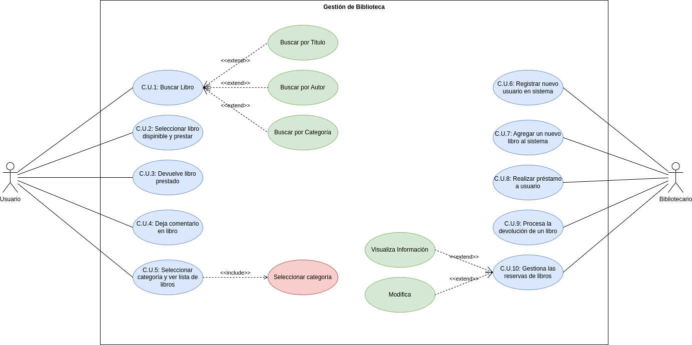

## Actores

 

 

 

## Casos de Uso

 

 

 

## Diagrama

 

 

 

|  Actor | Usuario |
|---|---|
| Descripción  | _Persona que pretende sacar un libro de la biblioteca_  |
| Características  | _Características que describen al actor_ |
| Relaciones | - - -  |
| Referencias | _C.U.1_ |   
|  Notas |  _Notas adicionales_ |
| Autor  | _Quien desarrolla la especificación del actor_ |
|Fecha | _Fecha de la especificación_ |

|  Atributo |||
|---|---|---|
| _Nombre_  | _Descripción_  | _Tipo_ |
| | |
