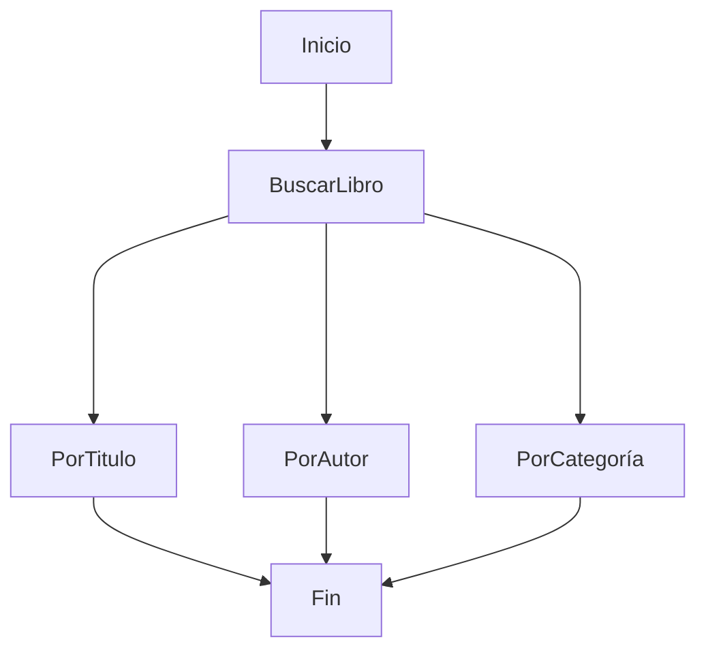
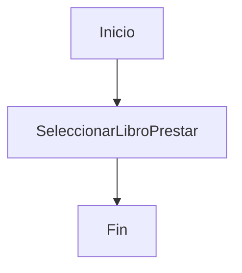
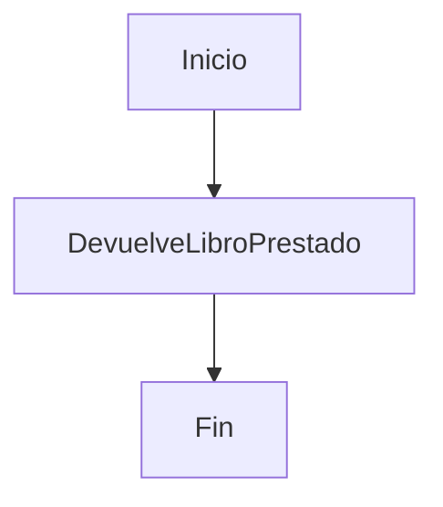
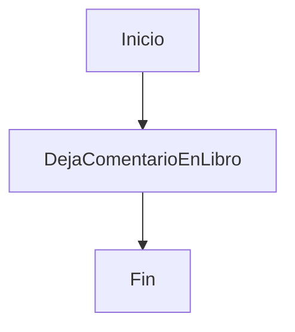
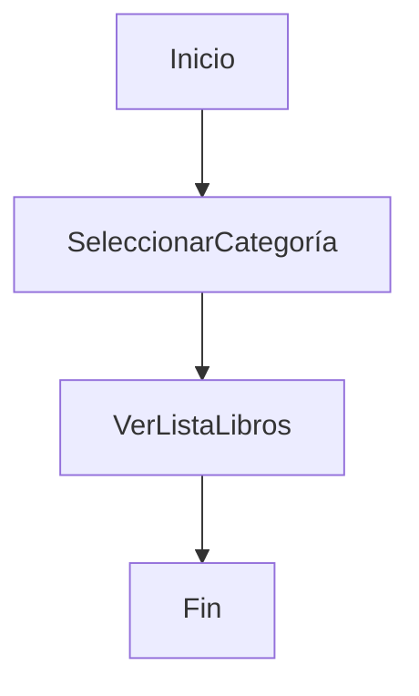
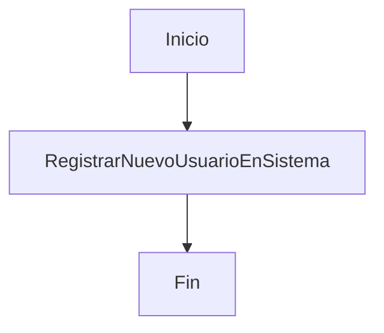
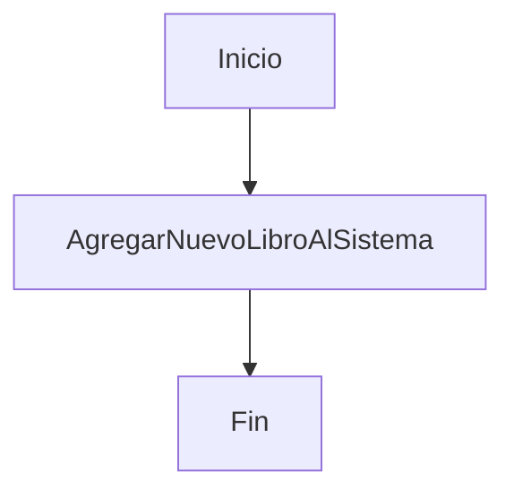
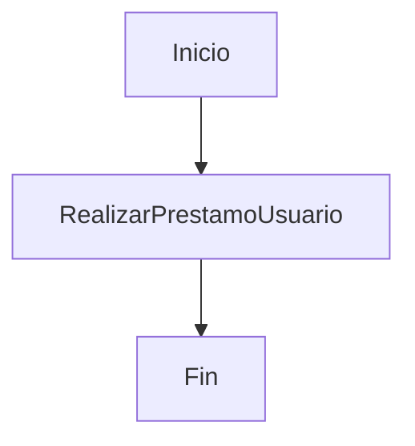
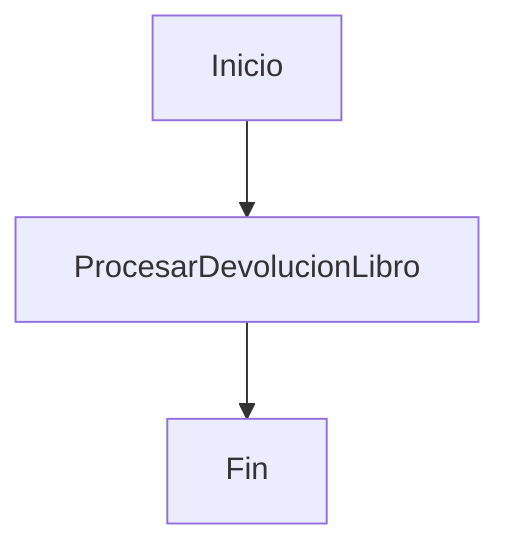
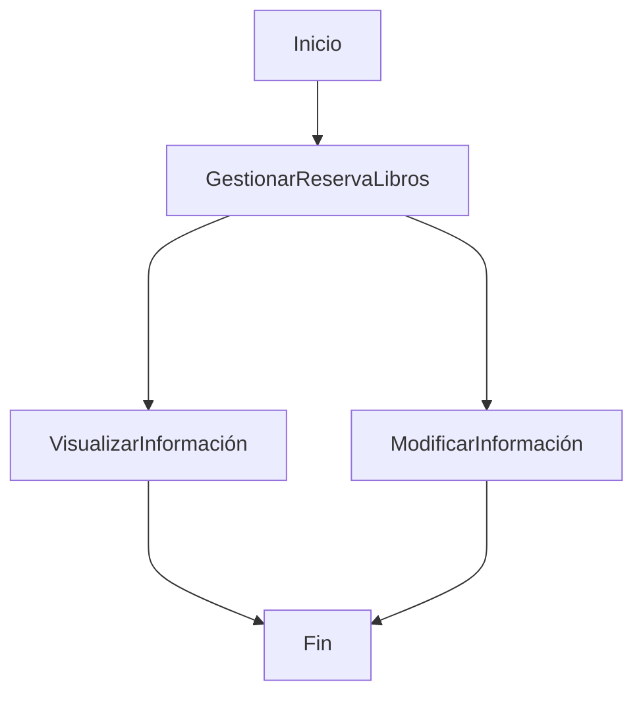

 

# Diagramas de Actividad

 

 

En este documento podremos ver los Diagramas de Actividad sobre los [casos de uso](https://github.com/PeterMartEsc/proyecto_biblioteca/tree/main/diagramas/diagrama-casos-uso)

## Caso de Uso 1

## Caso de Uso 2

## Caso de Uso 3

## Caso de Uso 4

## Caso de Uso 5

## Caso de Uso 6

## Caso de Uso 7

## Caso de Uso 8

## Caso de Uso 9

## Caso de Uso 10

